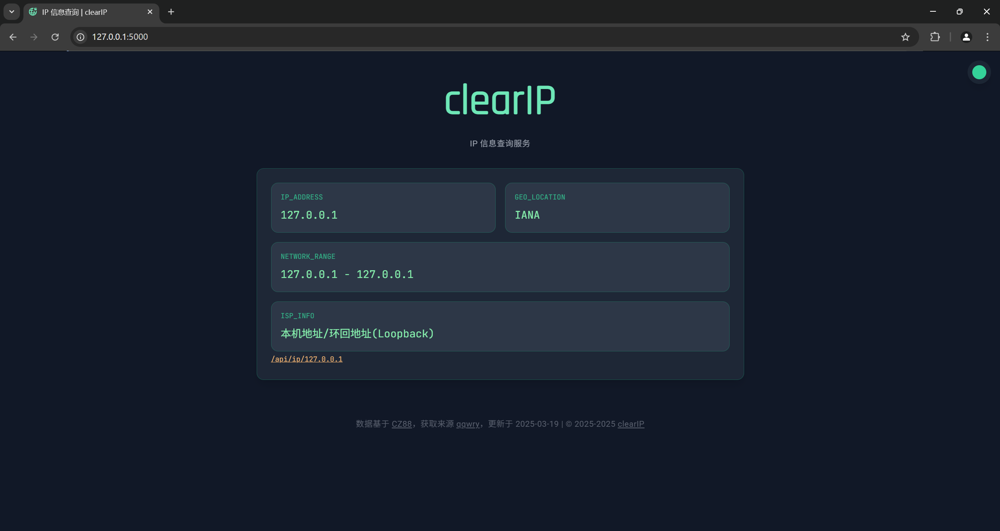
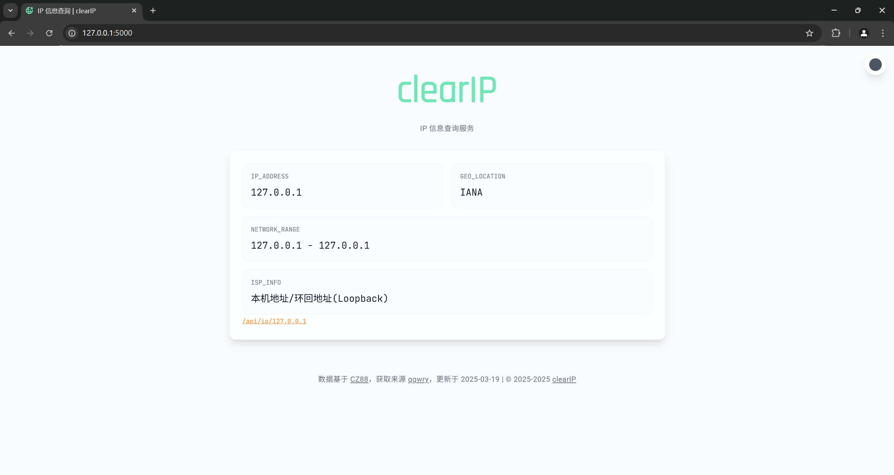

# clearIP


基于[纯真数据库](https://cz88.net/)的 IP 信息获取页面。

数据文件获取自项目 [nmgliangwei/qqwry](https://github.com/nmgliangwei/qqwry)。为方便使用，将原本的 `.dat` 数据文件解析导入进了 sqlite 数据库中。

> [!WARNING]
> 本项目仅用于学习参考，部署到生产环境前需谨慎配置。

## 运行

1. 克隆本项目

```bash
git clone https://github.com/GitZhiQing/clearIP.git && cd clearIP
```

2. 安装依赖

本项目使用 [uv](https://docs.astral.sh/uv/) 作为包管理工具。

```bash
uv sync
```

3. 解析 `qqwry.dat` 数据文件

可以从项目 [nmgliangwei/qqwry](https://github.com/nmgliangwei/qqwry) 获取。

- 创建 `data` 目录，将准备的 `qqwry.dat` 文件放入 `data` 目录中

```bash
mkdir data
```

- 运行 `flask initdb` 解析文件，将数据导入 sqlite 数据库

```bash
flask initdb
```

4. 运行

> [!WARNING]
> 若要将此应用暴露在公网，请确保关闭了 [Flask 调试模式](https://flask.palletsprojects.com/en/stable/debugging/)，且不要使用[开发服务器](https://flask.palletsprojects.com/en/stable/server/)。

```bash
flask run # 此命令仅用于开发预览
```

## 效果



